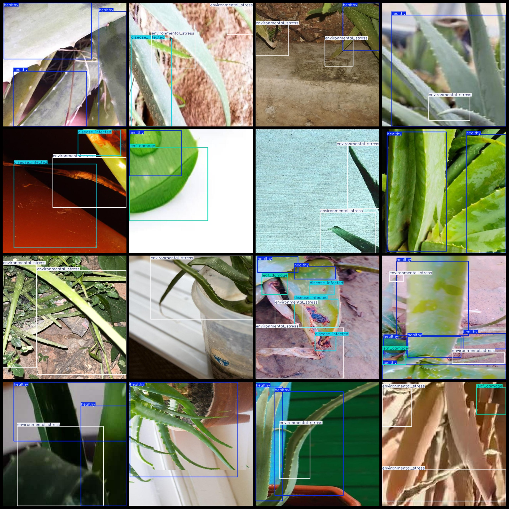
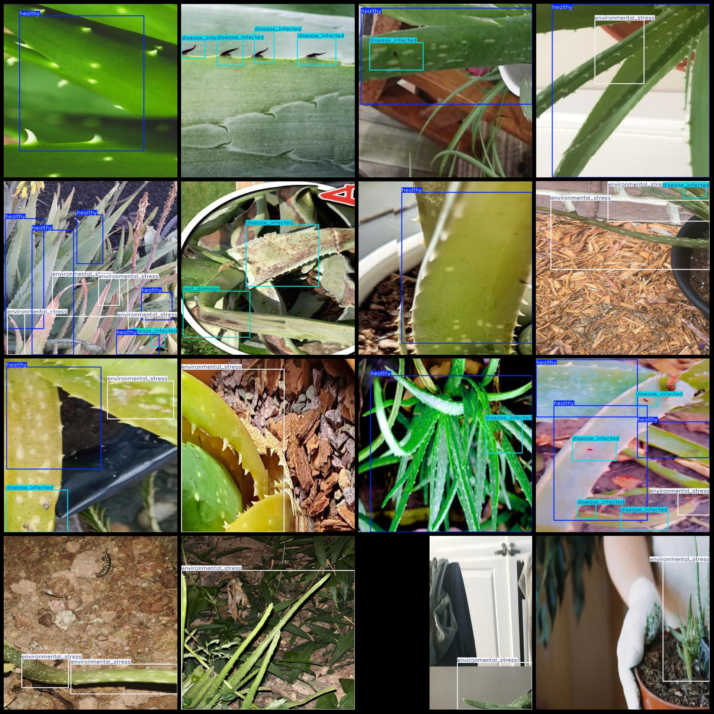

# Aloe Vera Leaf Health Status Detection Dataset (VOC+YOLO) Format: 2989 Images of 4 Categories

Dataset format: Pascal VOC format + YOLO format (without split path in txtfile, only containing jpgimage and corresponding VOC format xmlfile and yolo format txtfile)
number of images: 2989  
annotation count: 2989  
annotation count: 2989  
annotationnumber of classes: 4  
The labels are "disease_infected", "environmental_stress", "healthy", and "leaf_damage".
The number of boxes labeled in each category:
Disease-infected boxes count is 1732.
The number of environmental stresses (environmental stress) is 2059.
Healthy box count = 3448
Leaf damage box count = 582
total boxes: 7821  
images per class:   
The image "disease_infected" is a 911 call that was made in response to a suspected animal disease outbreak. The image itself does not contain any text or other information, but rather shows a screenshot of the 911 emergency call center's screen where the caller has reported a potential animal disease outbreak.
Environmental stress refers to the adverse conditions that affect an organism's survival and development. These conditions can include changes in temperature, humidity, light, nutrients, and other environmental factors. Environmental stress can have a significant impact on plant growth, animal behavior, and even human health.

In the context of digital images, environmental stress could refer to the various challenges or limitations that an image faces during its creation or processing. For example, if an image is taken under harsh lighting conditions or has poor quality due to low resolution, it may be considered to be experiencing environmental stress. Similarly, if an image is processed using advanced techniques that require specialized equipment or software, it may also be considered to be experiencing environmental stress.

Overall, understanding the concept of environmental stress in the context of digital images can help us better appreciate the challenges faced by artists and scientists when creating or processing images. By recognizing these challenges and finding ways to overcome them, we can continue to advance our understanding of the world around us through visual representation.
The number of images that are "healthy" is 2154.
The leaf damage (425) is an attribute of the image.
Image resolution: 640x640
Use annotation tool: labelImg
Annotation rules: draw a rectangle around the class.
Important notes: The dataset does not have separate training, validation, and test sets; you need to partition them yourself.
Special statement: This dataset does not guarantee the accuracy of the trained model or weight file.
Image preview:
## Images

Here is a pay link on Stripe ( https://buy.stripe.com/3cs8yP7sY87d0vu9AB ). Please contact me lonlonago@foxmail.com after funding $89, and I will send you a complete data files , thank you!

